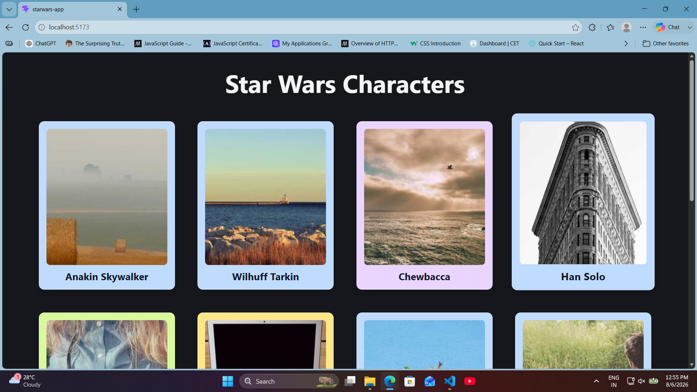
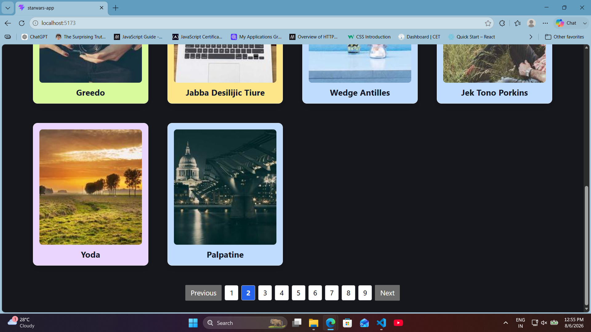
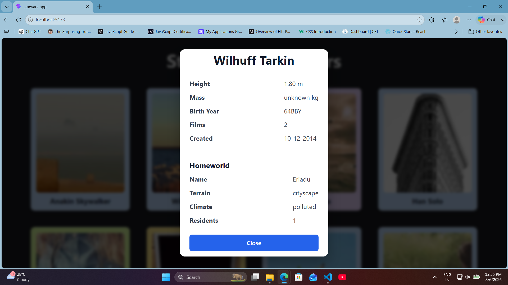
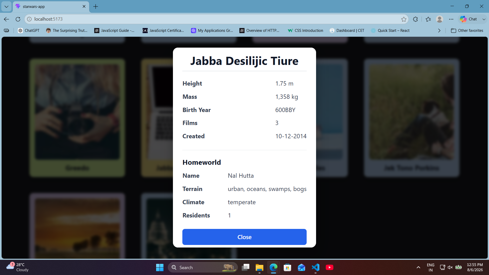
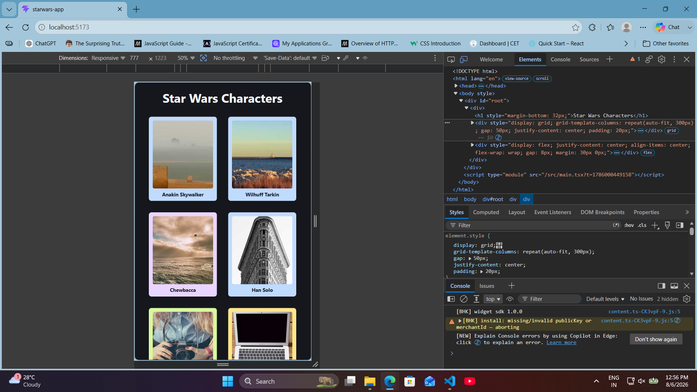

# Star Wars Character Browser

A responsive React + TypeScript application that displays Star Wars characters using the Star Wars API (SWAPI). The application features pagination, animated character cards, detailed character information in a modal, and dynamically fetched homeworld information.

## Features

- Fetches Star Wars characters from the SWAPI `/people` endpoint
- Pagination (10 characters per page)
- Responsive character card layout
- Random image assigned to each character
- Species-based card colors
- Hover animations using Framer Motion
- Character details displayed in a modal
- Homeworld information fetched on demand
- Loading and error handling
- Modal closes by:
  - Clicking outside the modal
  - Pressing the **Escape** key
  - Clicking the **Close** button
- Prevents background scrolling while the modal is open
- Responsive design for desktop and mobile devices

## Screenshots











## Tech Stack

- React
- TypeScript
- Vite
- Axios
- Framer Motion

## Project Structure

```text
src/
│
├── components/
│   ├── CharacterCard.tsx
│   └── CharacterModal.tsx
│
├── services/
│   └── api.ts
│
├── types/
│   ├── Character.ts
│   └── Homeworld.ts
│
├── App.tsx
├── index.css
└── main.tsx
```